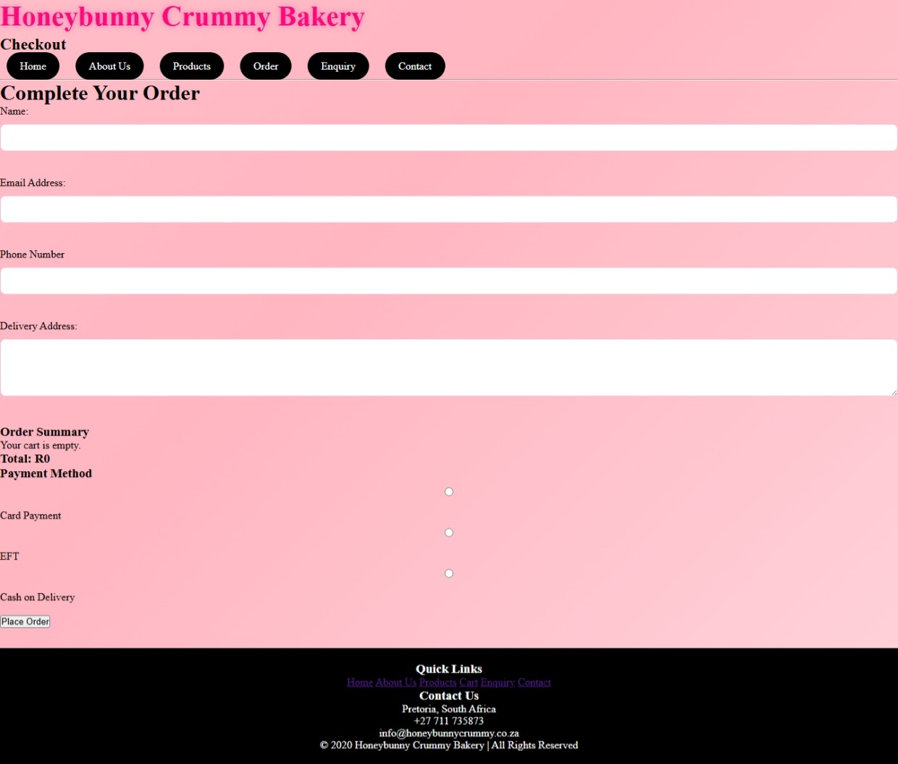
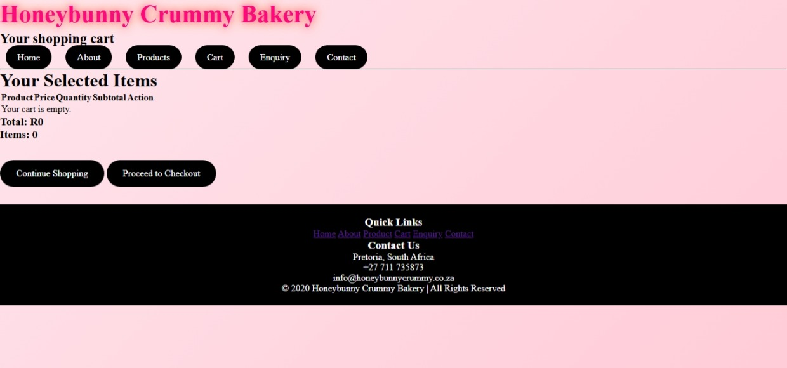

# Honeybunny Crummy Bakery Website
Welcome to the official repository for the HoneyBunny Crummy Bakery website.
This is a simple bakery e-commerce web project that allows users to browse products,
 add items to a cart,and proceed to checkout.

 ## Project Overview
 The HoneyBunny Bakery website is designed to simulate a basic online bakery store.
 It provides users with an interactive shopping experience where they can select baked goods and 
 manage their orders through a cart system.

 ## Features
 Responsive homepage with bakery branding
 Product listing page with clickable items
 Functional shopping cart system
 Add-to-cart functionality for products
 Basic checkout page layout
 Javascript-powered interactivity

 ## Technologies used
  HTML5 - Page structure
  CSS - styling and layout
  Javascript - interactivity and cart functionality

  ## Project Structure
  Homepage - index.html
  Product - product.html
  Cart - cart.html
  Checkout - checkout.html
  CSS file
  Java script file

  ## How it works
  Users browse bakery products on the product page 
  Clicking a product adds it to shopping cart
  Users can view and manage items in the cart page
  The checkout page allows users to review their order before final submission

  ## Future Improvements
  Add payment getaway integration
  Store cart dat using local storage or database
  Improve mobile responsiveness
  Add user login and registration system 
  Include product search and filtering

  ## Preview
  
  

  ## References

(Harvard referencing style)
[Accessed: 20 March 2026]
BakeryBusinessBoss. 19 May 2025, Five Content Ideas for a bakery website Available at: Home - Bakery Business Boss
[Accessed : 24 March 2026]
Bakerita | gluten free and vegan Baking ,2025 . ultimate chocolate cupcakes , available at: Bakerita | Gluten Free, Dairy Free & Refined Sugar Free Recipes
[Accessed : 24 March 2026]
Chefdora , 2020. Scones (Dikuku).[Image online] Available at: Chefadora - Share & Discover Recipes from Around the World | Chefadora
[Accessed : 24 March 2026]
Essencce cheese, 2026 . Easy cherry Cheescake Recipe( baked and no bake versions)[Image online] , Available at: home - essencecheese
[Accessed : 11 March 2026]
Erasmas,B_l Strydom,J.W and Rudansky-Kloppers,S.(eds.) 2023. Introduction to business management 12th edition . Cape Town : Oxford University Press
[Accesed: 20 March 2026]
Muffingroup . 8 January 2026, Stunning Bakery Website design examples to inspire you, Available at: Muffin Group | The Most Popular WordPress Theme In The World

## Author
Developed by: Ntokozo Latoya Mkwanazi
Project: WEDE POE

